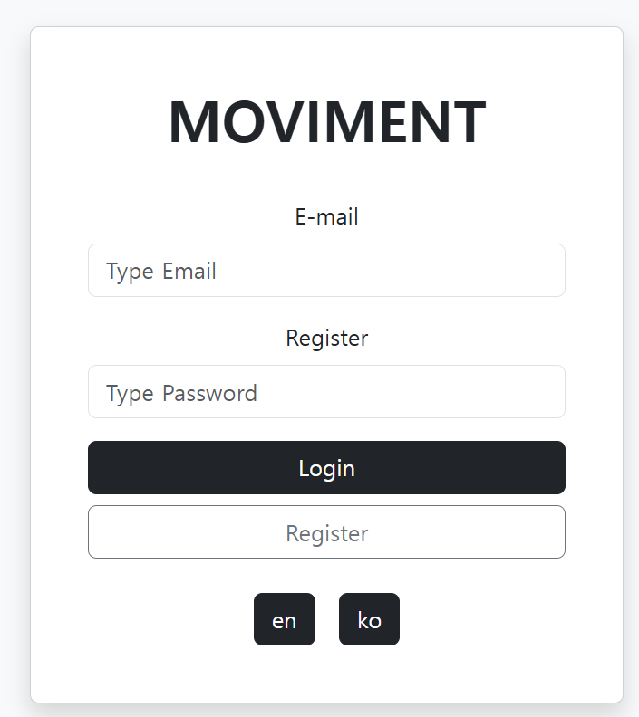
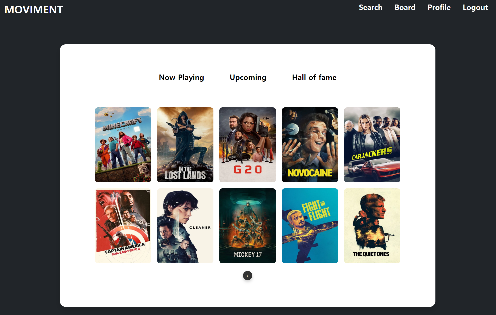
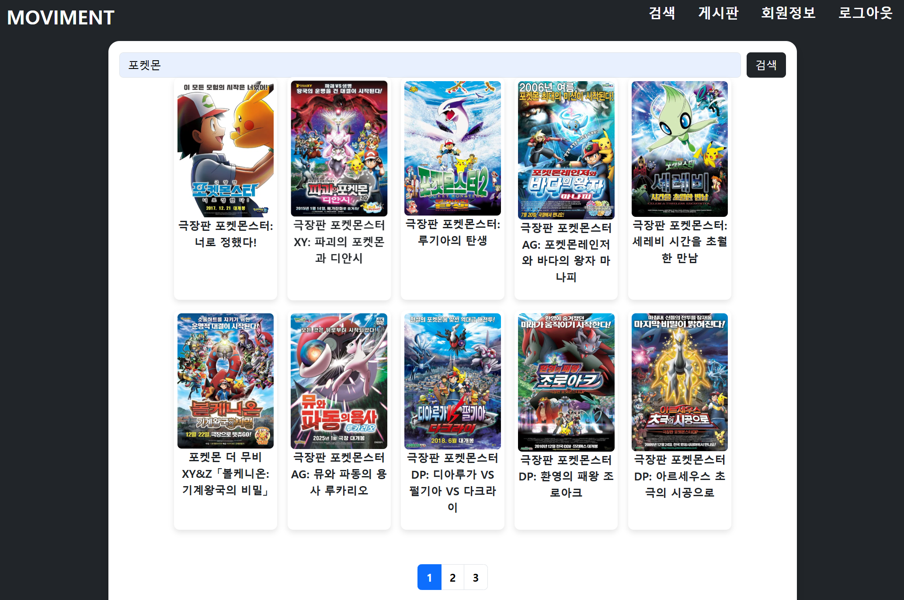
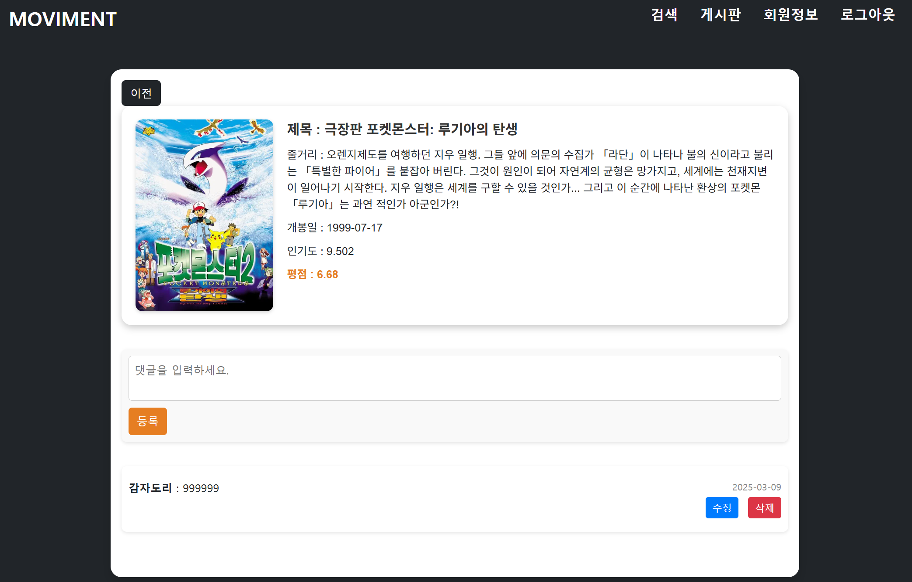

# Moviment
TMDB API를 활용한 영화 정보 플랫폼입니다.  
최신 영화, 개봉 예정작, 영화 랭킹 등 다양한 정보를 제공하며, 사용자 간 커뮤니케이션을 위한 게시판 및 댓글 기능도 함께 제공합니다.

# 주요 기능
* 최신 영화, 개봉 예정작, 인기 영화 순위 조회
* 영화 상세 페이지 및 리뷰(댓글) 작성
* 게시판 기능 (글 작성, 수정, 삭제)
* 회원가입 / 로그인 / 회원 정보 수정
* 다국어 지원 (한국어, 영어)

### 회원가입
- 사용자가 입력한 비밀번호는 `BCrypt`로 암호화하여 저장
- 중복 이메일 여부는 저장 전 확인 (별도 로직 필요)

### 로그인
- 이메일을 기준으로 사용자 조회
- 입력한 평문 비밀번호와 암호화된 비밀번호를 `matches()`로 비교
- 로그인 실패 시 실패 횟수(`pwdErrCnt`) 증가
- 실패 횟수 5회 이상일 경우 로그인 제한
- 로그인 성공 시 실패 횟수 초기화

### 회원 정보 수정
- 이메일로 사용자 조회 후 현재 비밀번호 확인
- 새 비밀번호와 비밀번호 확인이 일치하는 경우에만 수정
- 수정된 새 비밀번호는 `BCrypt`로 암호화하여 저장

### 보안 처리
- 비밀번호는 평문 저장 없이 암호화 저장
- 로그인 실패 횟수 제한 (5회 초과 시 차단)
- 사용자 정의 예외(`LoginException`, `UpdateUserInfoException`)로 상황별 메시지 전달

 

  
  
  

### 영화 검색 (`searchMovies`)
- 키워드 기반 영화 검색
- TMDB API를 통해 여러 페이지의 결과를 병합
- 총 페이지 수에 따라 페이지네이션 처리
- 다국어 지원 (`language=ko`, `language=en`)

### 카테고리별 영화 목록 (`getListOfMovieListByType`)
- `nowPlaying`, `upComing`, `topRated` 타입별 영화 조회
- 사용자 페이지 기준 → TMDB 페이지로 변환하여 요청(20개 반환)
- 10개씩 나누어 제공

### 영화 상세 조회 (`searchDetail`)
- 영화 ID 기준 DB에 저장된 영화 정보가 있으면 그대로 반환
- 없으면 TMDB API로 상세 정보 요청 후 DB에 저장

#### 영화 리뷰 기능
- `searchReview`: 특정 영화의 리뷰 목록 조회
- `addReview`: 리뷰 작성
- `patchReview`: 리뷰 수정
- `deleteReview`: 리뷰 삭제

---

### 예외 및 에러 처리
- TMDB API 호출 실패, 응답 누락, 데이터 이상 시 `MovieException` 발생
- 검색 결과 없음, 잘못된 페이지 접근 등의 상황 처리 포함

---

### API 연동 방식
- `RestTemplate + HttpHeaders` 이용
- Authorization: Bearer Token 방식
- `ObjectMapper`를 활용한 JSON 파싱

# 기술 스택
* Frontend : JSP, HTML5, CSS3, Bootstrap
* Backend : Java, Spring MVC, MyBatis
* Database : Oracle
* API : TMDB API(https://developer.themoviedb.org/)
* 기타 : AJAX, JSTL

# 차후 개선 사항
* API 활용 MovieController, RestController 전환(완료)
* 한국어 및 영어 다국어 지원(진행 중)
* 게시판 기능 수정
* TMDB API 키 노출 방지 예정
* TMDB 언어별 테이블 분리

